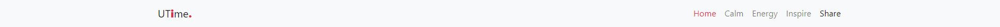
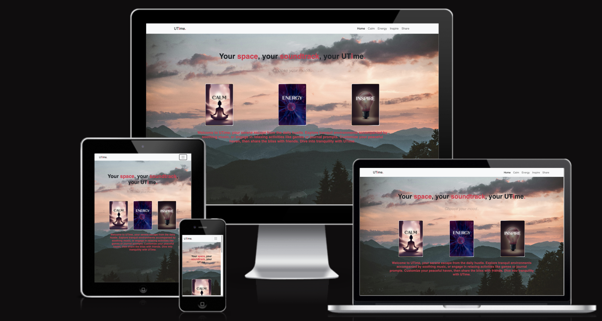
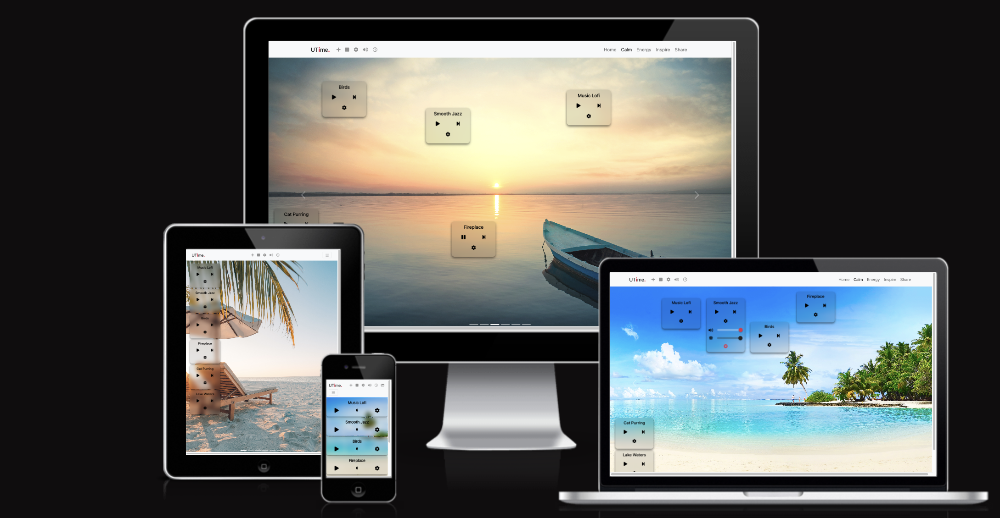
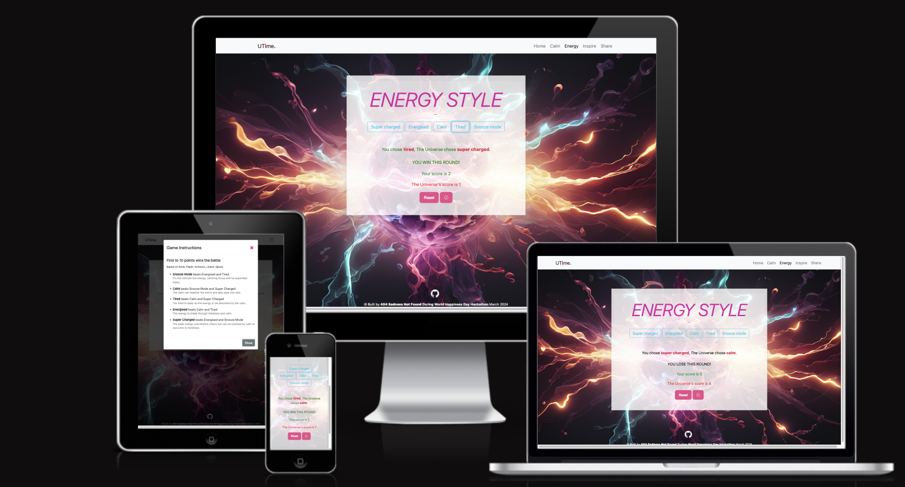
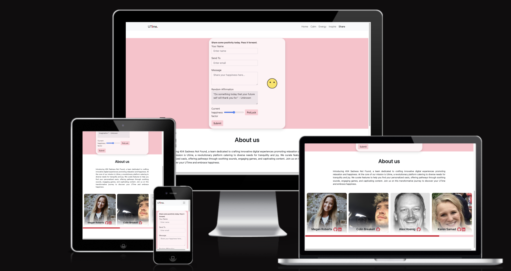

# UTime 😊 by 404 Sadness Not Found
## ***Your space, your soundtrack, your UTime.*** 

## Introduction

To celebrate World Happiness Day, The UTime app brings an opportunity for users to find their own on-screen happy place. A user can find a moment of calm by personalizing a visual and musical escape. Alternatively, they can re-energize their productivity by playing one of our happy games. Then, to make the world an even happier place, a user can then share their curated spaces with friends using our built in email service.

------

## Showcase
** Content **
** Am I responsive **
** Deployed site **

------

# Site Goals

## Problem Statement

In a busy world with many of us working from home, it can be difficult to take time and find a true moment of happiness in our day. Studies have shown how important both laughter and moments of calm can be to alleviate some of life's stress. We therefore decided to build a platform that can provide these things to a user, right on their screen.

** Possibly opening content from webpage if this relates to the "problem" **

## Objectives

To celebrate World Happiness Day, our objective was to create a harmonious space where users could navigate to content that would provide them with happiness. This meant creating content that would appeal to people looking for different things: 

1. An online moment of calm - achieved through a visual and auditory experience.
2. Reinvigorating energy - by playing a game with a soundtrack to match.

We then wanted a user to be able to share their happiness with others by incorporating an email service.

### Target Audience

The target audience for this app is anyone looking to add happiness to their day. Although the platform is most suited to be used by adults, children could navigate all of the content safely. The app has the potential to be used for one-off happiness searches but also as part of a daily happiness or calm-finding schedule. Additionally, the soundscape feature has the potential to run in the background throughout a user's day. The universal enjoyment that comes from being happy gives this platform year-round applicability.

### User Requirements and Expectations

- Explanation of what the site offers is easy to understand
- Scenes and sounds work as expected
- Game is intuitive and fun to play
- All content is clear and accessible
- Features and navigation work as expected
- Option to learn more about Sadness Not Found and the app
- Visually Attractive
- Option to share what a user has found via email

### User Stories

As a first time user I would like:

- To understand the different happiness areas the site offers and how to use them
- To navigate to my desired page easily
- To explore other areas of the site without having to navigate home
- To be able to choose from a selection of predefined images and sounds
- For the game to load quickly and contain smooth animations and features
- To enjoy using the site in part due to the pleasing aesthetics and affordances

As a returning user I would like:

- To be able to choose my own music to accompany my scene of choice
- To be able to find previous soundscapes to load quickly
- To play a different game to what I played last time

### Trade Offs

The following table outlines the content that should be implemented to make a functional website that appeals to users. This takes into account their expectations and the requirements for the site. Due to time constraints, some of the features that were discussed during the planning phase could not be incorporated for this project sprint (marked by N).

| Opportunity                                                                | Importance | Viability / Feasibility | Implemented?|
| ---------------------------------------------------------------------------| :--------: | :---------------------: | :----------:|
| Home page to showcase app features and link to each page                   |     5      |            5            |       Y     |
| About page with more information about the 404 Sorry Not Found team        |     5      |            5            |       Y     |
| Preset sounds loaded on Soundscape/game page for a user to chose           |     5      |            5            |       Y     |
| Carousel of images for a user to veiw different visual opportunities       |     5      |            5            |       Y     |
| Ability to search for pictures on a theme                                  |     3      |            5            |       N     |
| Option to upload own music into the energy/calm spaces                     |     5      |            4            |       Y     |
| Option to find an inspiring quote                                          |     3      |            5            |       Y     |
| Info modal that tells the user how to play the game                        |     4      |            5            |       Y     |
| Score incrementation with successful game elements                         |     5      |            5            |       Y     |
| Option to send curated spaces by email to a friend (via the built in form) |     5      |            5            |       Y     |
| User feedback after submitting the form                                    |     5      |            5            |       Y     |
| Page to remember soundscape profiles (for quick loading on return visits)  |     3      |            3            |       N     |
| Links to social media                                                      |     5      |            5            |       Y     |

### Features

- **All Pages**

- All pages have a Navbar displaying the Utime logo and page title. It also includes navigation links to other pages, which condense into a burger menu on small screens.

 
 

- Additionally, each page features a footer with links to social media sites.

- **Home Page**

 

- The home page explains to the user what the site is about and displays the different 'happy' activities users can choose from, including Games, Soundscape, or Memes. 

- **Calm Page**

 

- This page opens with the slogan 'Create a happy place.' It is a page where users can choose from a preselected sound to accompany an image of their choice (selected using the carousel of images). They can then sit back and enjoy the page, creating their own moment of calm in a busy, screen-filled day.

- The pre-loaded music options offer flexibility, allowing users to position them anywhere on the screen. Coupled with the ability to adjust their appearance using the contrast slider, users can seamlessly integrate them with the background image, minimising distractions and enhancing the visual experience. The other in built options allow a user to pause the music, change the volume or remove any music they don't want to appear on their page.

    

- The navbar on this page has additional features, all of which are explained to a user when the hover over the feature. 

    - They have furhter options for controlling the music and their space. They can add new music of thier choice, stop all music, close the music setting menus and mute the music.

         

    - Users also have the option to add a timer, allowing them to keep track of how long they have been in their personalised space. The aim is that this could become part of a users daily routine to find some time for them and just sit in a calm space for say, 5 minutes at a time. The timer play button toggles between a play, stop and reset icon to give the user control of this feature. Additionally, users have the flexibility to relocate this display to their preferred position on the screen.

        

    - Demo of Calm page user experience and design (UXUI)
   

        
??ZZ???W?W??W  add in what it looks like on small screens  <<><><<>>>

- **Energy Page** 

 

??ZZ???W?W??W  content <<><><<>>>

- **Inspire Page**

 

??ZZ???W?W??W  content <<><><<>>>

- **Share Page**

??ZZ???W?W??W THESE NEED UPDATING TO HAVE FOOTER TOO <<><><<>>>

The Share page facilitates users in spreading positivity from the app. Users can input their name and the recipient's email, compose a personalised message, and opt to include a Random Affirmation. Additionally, users can convey their happiness level through an emoji face, adjustable via the slider or PotLuck button.

A "Submit" button allows users to submit the form. Upon submission, a confirmation message is displayed to inform the user that their message has been sent.

??????? explantation for recipient >??????

The page transitions into an "About" section, offering a summary of the site's purpose and its design intentions. It introduces the team behind its creation—404 Sadness Not Found—displayed via a slider bar. Each team member is presented with a link to their preferred contact method.

### Future Features

Due to time and skill constraints, the following features were not implemented at this time but should be considered for future rollouts:

1. Ability to search for pictures on a theme in the calm area.
2. Page to remember soundscape profiles (for quick loading on return visits)
3. To improve the email feature, we envision allowing users to easily share their personalised space. Our idea involves integrating an email form accessible on each page, pre-filled with the current page settings. Recipients would then be able to open the shared space with all the pre-loaded settings, such as the chosen image or sound. Due to skill limitations within the team this was not feasible at this time. 
4. To improve the selection of games avaiable to play

## Planning and Development

### Wireframes

Wireframes for the website were created using 

### Game Development

?????????????????????

### Emails

An [EmailJS](https://www.emailjs.com/) account was created, linked to an email provider and used to create [this](documentation/rm_images/email_template.png) email template, including the email address, sender's name, and message. Upon submission of the form, the EmailJS API sends the message using the Gmail account based on the form values created. 

### Agile Methodology

Agile devlopment techniques were implemented throughout this project. A GitHub Kanban board was utilised to keep a track of different tasks and asign them to different people. The board can be viewed [here](https://github.com/users/MeganRoberts-dev/projects/4)

### Brand and Identity

All decisions were decided as a team 

- The brand name: **404 Sadness Not Found** 
- The app name: **Utime.**
- Our slogan: **Your space, your soundtrack, your UTime.**

#### Logo image 

Our logo was designed in-house with simplicity and sleekness in mind, ensuring it complements rather than distracts from the site's content. This conscious decision aims to keep users immersed in their own environment. Additionally, the design emphasises the words "i" and "me" within the word "Time," cleverly playing on the concept of a user's personal space.

#### Colour Palette

??ZZ???W?W??W  content <<><><<>>>

imput colours for screenshot cooloors: 

rgb(221, 47, 76)
rgba(255, 255, 255, 0)

+??

## Tools and Technologies

- **HTML** - Used for structuring the content of the website.
- **CSS** - Used to style the appearance of the app's content.
- **Javascript** - Used to add dynamic behavior and allow user interaction with the web pages.
- [JSON](https://www.json.org/json-en.html) - Used for storing a disctionary of quotes and affirmations in a standard format.
- [GitHub and Github Pages](https://github.com/) - Used to store the code and host/deploy the live project.
- [GitPod](https://www.gitpod.io/) - IDE for development
- [Visual Studio Code](https://code.visualstudio.com/) - IDE for development
- [Chrome Developer Tools](https://developer.chrome.com/docs/devtools/) - For testing and troublshooting code.
- [Lighthouse](https://chromewebstore.google.com/detail/lighthouse/blipmdconlkpinefehnmjammfjpmpbjk) - To automatically test the performance, quality, and correctness of the web app.
- [Coolors](https://coolors.co/) - To generate a colour palette for the website design.
- [ChatGPT](https://chat.openai.com/) - Used to help research and problem solve general coding issues
- [Cloud Convert](https://cloudconvert.com/) - For resising and converting image files to webp format
- [Canva](http://canva.com) - For the README banner
- [EmailJS](https://www.emailjs.com) - An email framework used to send content from the site.
- [Favicon](https://favicon.io/) - For converting the site's logo into a favicon.ico file.
- [Canva](https://www.canva.com/) - To create the README banner and images for index.html
- [GoDaddy](https://www.godaddy.com/) - For Website Domain Name: www.utime.me (re-routes to github pages site).
- [HTML Games](https://www.htmlgames.com/html5-games-for-your-site/) - To add game HTML and functionality to the app.
- [JSHint](https://jshint.com/) - To validate JS code
- [W3 HTML validator](https://validator.w3.org/nu/) - To validate HTML
- [W3 Jigsaw](https://jigsaw.w3.org/css-validator/validator) - To validate CSS
- [AmIResponsive?](https://ui.dev/amiresponsive) - To create a mockup of the website on different devices in a range of sizes.

??ZZ???W?W??W  <<><><<>>>
TO CHECK (and reqord):
- [Balsamiq](https://balsamiq.com/wireframes/) - Used to create wireframes during project planning
- [Google Fonts](https://fonts.google.com/specimen/Dosis) - used to generate a visually appealing font

## Testing

Testing information can be found in the separate [TESTING.md](TESTING.md) file. 

## Bugs

The folowing bugs have been identified and due to time constraints, persist in the site. For future roll outs these would be addressed and fixed. 

| Bug number | Description of Issue | "Fix" |
| :--------: | :---------------------: | :---------------------: |
| 1 | Iphone devices do not let you play more than one music track at a time | None at present. A user on an iphone can only select one sound at a time | 
| 2 | Iphone devices do not let you change the individual volumes for sounds | The volume control feature is hidden from iOS users on a small screen. 

## Deployment and Local Development

### Deployment 

The Utime deployed site can be found [here](https://meganroberts-dev.github.io/march-24-hackathon-utime/)

It was deployed using GitHub pages with the following steps:

1. Login (or signup) to Github.
2. Navigate to the project repository.

    Our project repository can be accessed from GitHub [here](https://github.com/MeganRoberts-dev/march-24-hackathon-utime)

3. Navigate to the settings button at the top of the page.
4. Select pages from the left hand menu.
5. Under "Build and Deployment" click the branch dropdown menu and change it to "main". lick save.
6. The site can then be found from the "Deployments" section in the repository.
7. Under "All Environments" the page can be slected from the active deployments. 

### Forking and Cloning the Github Repository

The project can be forked or cloned to make a local copy on your system

First follow steps 1. and 2. above

Then to fork:

1. Click on the fork button at the top of the page. 

To clone:

1. Under the "Local" tab, click on the code button and select how you would like to clone (HTTPS, SSH or GitHub CLI).
2. Copy the link to your clipboard and use it to create a new workspace in your chosen IDE.

??ZZ???W?W?? POSSIBLY SOME MORE WORK MAKING THIS MORE ADVANCED <<><><<>>>

## Credits

Resources used on the site were taken from the following sources:

- [Pexels.com](https://www.pexels.com/) - For share page image with specfic credit to Mavera zehra Çoşkun
- [Gencraft](https://gencraft.com/generate) - For error 404 background
- [YouTube](https://www.youtube.com/) - For music and sounds
- [OpenMoji](https://openmoji.org/) - For email emojis
- [indeed.com](https://uk.indeed.com/career-advice/career-development/historical-quotes-examples/) - For inspirational quotes
- [Kevin Levron](https://codepen.io/soju22/pen/rNREwzr) - For Bokeh Effect on inspire.html
- [Megan Roberts](https://github.com/MeganRoberts-dev/feb-24-hackathon-love-riot) - For Email logic and functionality

The 404 Sadness Not Found Team:

- [Meghan Roberts](https://github.com/MeganRoberts-dev)
- [Karen Samad](https://github.com/kosamad)
- [Alex Hoenig](https://github.com/A-Hoenig)
- [Colin Breakwell](https://github.com/BreakellrZ)
- [Soroush](https://github.com/SoroushGReza)