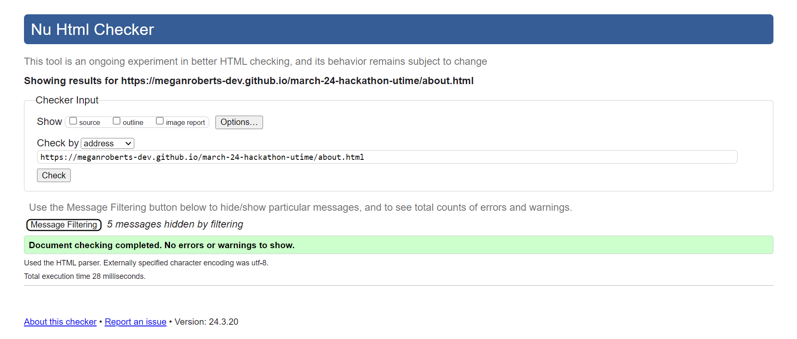
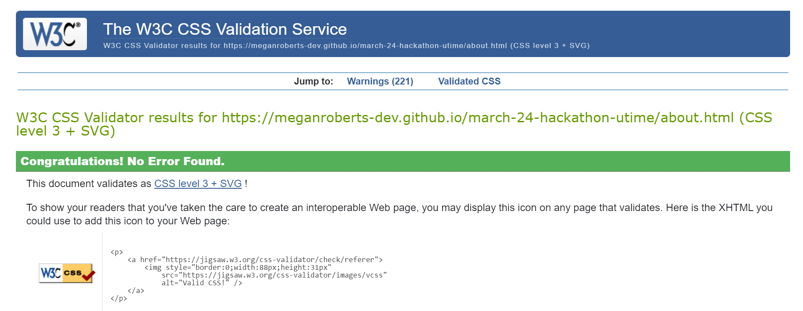

# Testing

Return back to the [README.md](README.md) file.

Testing ensures that the site functions as expected and provides a positive user experience (UX). The site underwent rigorous testing using various automated verification methods to scrutinise the code. Additionally, thorough manual testing was conducted to identify any potential issues or bugs.

Whilst building the game, the Chrome developer Tools were used to test pages for responsiveness to different screen sizes and to troubleshoot any problems that arose, using a systematic approach to find and fix issues.

## Automated Testing

## Code Validation

### HTML

[HTML W3C Validator](https://validator.w3.org) was used to validate all HTML files.

| Page | Screenshot | Notes |
| --- | --- | --- |
| Home |  | Pass.|
| Calm |  | Pass. |
| Energy |  | Pass.|
| Inspire |  | Pass. |
| Share  |  | Pass.|
| 404 Page |   | Pass. |

### CSS

[CSS Jigsaw Validator](https://jigsaw.w3.org/css-validator) was used to validate all CSS files.

| File | Screenshot | Notes |
| --- | --- | --- |
| Home |  | Pass.|
| Calm |  | Pass. |
| Energy |  | Pass.|
| Inspire |  | Pass. |
| Share  |  | Pass.|
| 404 Page |   | Pass. |

### Java Script

[JSHint](https://jshint.com/) was used to validate the JS.

| File | Screenshot | Notes |
| --- | --- | --- |
| email.js |   | Pass. |
| sound.js |   | Pass. |

## Lighthouse 

| Page | Mobile | Desktop | Notes |
| --- | --- | --- |
| Home |  |  | Pass. |
| Calm |  |  | Pass.  |
| Energy |  |  | Pass. |
| Inspire |  |  | Pass. |
| Share |  |  | Pass. |

## Manual Testing

### Browser compatibility 

During testing, we meticulously examined all clickable links, buttons, and interactive features to guarantee smooth functionality and a seamless user experience across different browser environments. 

The web browsers used for testing are:

1. MacOS Safari
2. Windows Edge
3. Google Chrome
4. 

It was also tested on multiple devices to ensure it was responsive and behaved as expected. Devices used for testing were:

1. Pixel4a (Android 13)
2. Iphone ??? - This identified some issues, please see [Known Bugs](./README.md#bugs) section of the README.md. 
3. 
4. 
5. 

## User Story Testing

### New Site User

| Goal | How are they achieved? |
| :--- | :--- |

### Frequent/Return User Goals

| Goal | How are they achieved? |
| :--- | :--- |
